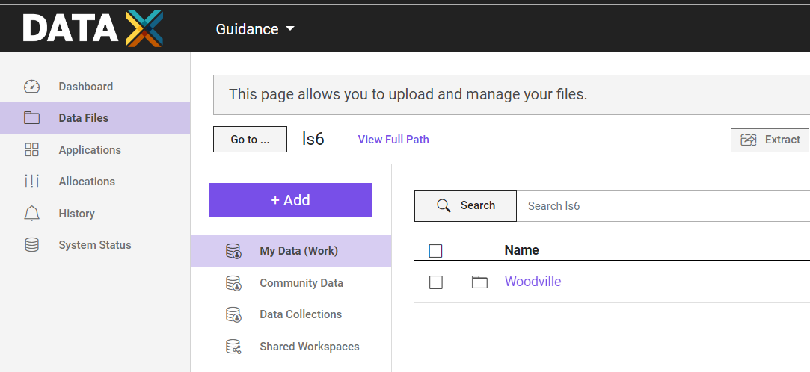
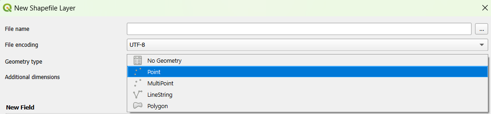
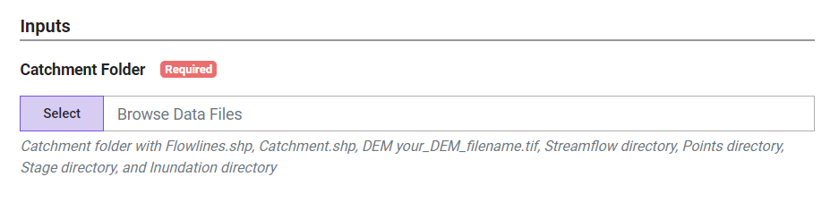
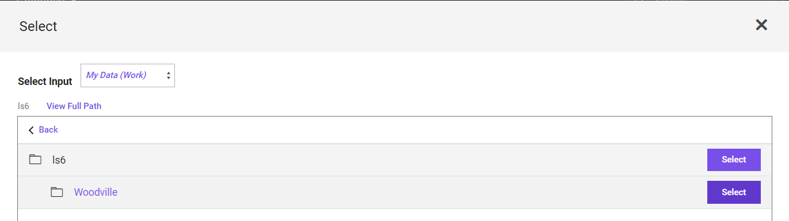
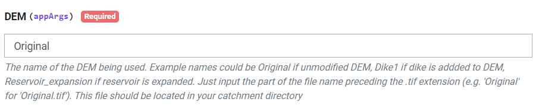
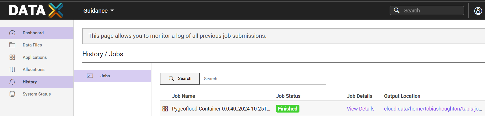

This cookbook developed with the [Cookbook UI](https://in-for-disaster-analytics.github.io/cookbooks-ui/#/apps) template can be used to run [pygeoflood](https://github.com/passaH2O/pygeoflood) as a container on TACC systems.

## Setting Up Catchment Directory

A catchment directory must first be developed. The catchment directory contains information about the catchment shape/area, flowlines, streamflow, elevation, and points of interest (see Woodville in examples for an example catchment directory). The catchment directory can be given any name including the area or catchment of interest. The catchment directory should be stored on TACC. For example, the catchment directory could be stored in Data Files > My Data (Work) > ls6.

### Catchment File

The catchment directory should contain a catchment shapefile named Catchment.shp with the outline of the catchment or area of interest (see Catchment.shp in the Woodville example). The file must be named Catchment.shp for the app to work.

### Flowlines File

The catchment directory should contain a flowlines shapefile named Flowlines.shp with the flowlines for the streams/rivers in the catchment (see Flowlines.shp in the Woodville example). The flowlines shapefile should contain the same fields as flowline data from [NFIE](https://www.arcgis.com/home/webmap/viewer.html?webmap=9766a82973b34f18b43dafa20c5ef535&extent=-140.4631,21.8744,-48.5295,57.4761). The file must be named Flowlines.shp for the app to work.

### DEM Files

The catchment directory should contain at least one DEM file with a .tif extension (see Original.tif in the Woodville example). You can name these DEMs however you would like as long as they have a .tif extension. If you are interested in analyzing how flood mitigation measures modelled using DEM modifications may impact inundation levels, you can add multiple .tif files. For example, if you would like to analyze the impact of a planned levee, you could add a .tif file named Levee.tif in addition to an Original.tif file representing current conditions.

### Streamflow Directory and Files

The catchment directory must contain a directory named Streamflow (see the Streamflow directory in the Woodville example). The Streamflow directory should contain .csv files with streamflow data for events of interest (e.g. Event1, Event2, Harvey). The .csv streamflow files should contain two columns, COMID and streamflow, which are the stream reach ID following the nomenclature used in NFIE flowlines data and the stream discharge in (m3/s). The streamflow files can be named according to the events of interest with the .csv extension (see Event1.csv, Event2.csv, Harvey.csv in in the Streamflow directory in the Woodville example). Try to use event names of less than 6 characters in length. Otherwise, event names will be abbreviated when adding fields if depths are extracted at points of interest due to field name length limits in shapefiles.

### Points Directory and File

Your catchment directory should contain a directory named Points (see the Points directory in the Woodville example). If you would like to extract depths at specific points of interest, you can add a shapefile containing these points in the Points directory inside the catchment directory (see the Critical_Infrastructure.shp file in the Points directory in the Woodville example).

Make sure the shapefile contains vector data with geometry type, "Point", as opposed to "MultiPoint". Otherwise the app will fail. For example, if creating your Points shapefile in QGIS, select "Points" here.

### Stage Directory

Your catchment directory should contain a directory named Stage (see the Stage directory in the Woodville example). This directory should be empty and is only used for temporary storage of flood stage files used to generate inundation maps.

### Inundation Directory

Your catchment directory should contain a directory named Inundation (see the Inundation directory in the Woodville example). This directory should be empty and is used for storing outputs.

## Inputs

The app requires only one input, Catchment Folder. You can select the path to your catchment directory stored on TACC here. The catchment directory should contain the files/directories described in the step before.

## Parameters

The app takes three parameters as appArgs, DEM, Points, and Flood Map List.

### DEM

You must select a DEM for the pygeoflood runs. Add the name of the DEM without the .tif extension. For example, if you would like to analyze flooding in your original, unmodified DEM saved as Original.tif in the catchment directory your input would be Original. If you would like to analyze flooding after the addition of a levee modelled as a modification to your DEM and saved as Levee.tif in your catchment directory, your input would be Levee.  

### Points

There are two possible options for this parameter:
1. None (Default) - If you don't want to extract depths at specific points leave this parameter as None.
2. Name of points file - If you would like to extract depths at critical points, you can add the name of your points shapefile stored in the Points directory. For example, if you would like to know depths at the points stored in the Critical_Infrastructure.shp shapefile, your parameter would be Critical_Infrastructure.

### Flood Map List

There are three possible options for this parameter:
1. All (Default) - If you would like to save/export rasters with inundation depth for each event modelled, use All as your input for this parameter.
2. List of events of interest in quotation marks - If you are running pygeoflood for a large amount of events and only care about inundation depth at specific points, you may not want to save the inundation depth rasters for every event. Instead you might only want to save a few inundation depth rasters for events of interest or as examples when presenting your results. In this case, your input for this parameter would be a list of the specific event names (corresponding to the filenames of the streamflow files for the respective events). For example, if you only wanted to save inundation depth rasters for the events corresponding to the streamflow files, Event1.csv and Harvey.csv, your input for this parameter would be 'Event1 Harvey'. Be sure to put the list in quotation marks. Otherwise the app will not work.
3. None - If you are running pygeoflood for a large amount of events and only care about inundation depth at specific points, you may not want to save any inundation depth rasters. In this case, you input for this parameter should be None.

## Outputs

### Inundation Directory

After the app runs, it will copy a directory named Inundation into the Tapis output directory. this directory contains the inundation depth rasters (as .tif files) you requested when defining the Flood Map List parameter.

### Points directory 

The app will also copy a Points directory into the Tapis output directory. This directory will contain a points file with the same name as the points shapefile you added in the Points directory in your catchment directory. For example, if you added a Critical_Infrastructure.shp file in the Points directory a file named Critical_Infrastructure.shp will also appear here. If you input the name of your points file in the Points parameter, the file will contain fields for each event with the inundation depth at each point. The field names will correspond to the event names for the given streamflow files. For example, for a event with the streamflow file, Event1.csv, the field, "Event 1 (m)," will contain the depths for this event.

## Summary of App Function

The app takes a catchment directory containing information about a catchment (i.e. catchment extent and flowlines), streamflow data for events, and a DEM. The app models inundation extent for each .csv file in the Streamflow directory for the chosen DEM using pygeoflood. Inundation depths can be saved for the entire study area using the flood maps or at specific points of interest using a points shapefile. 