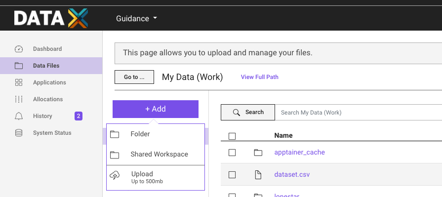
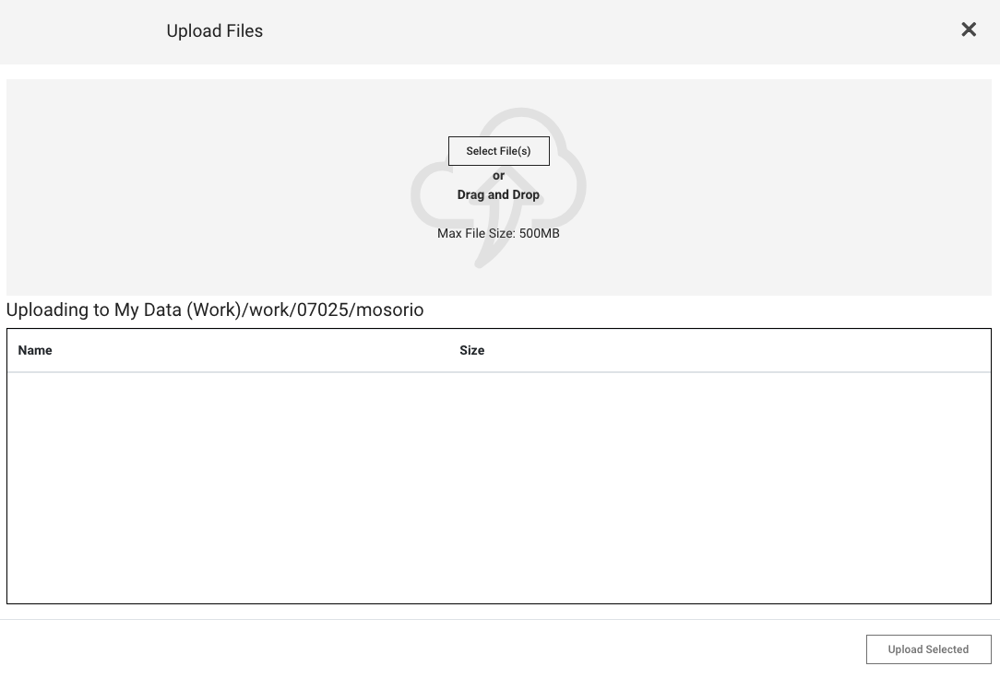
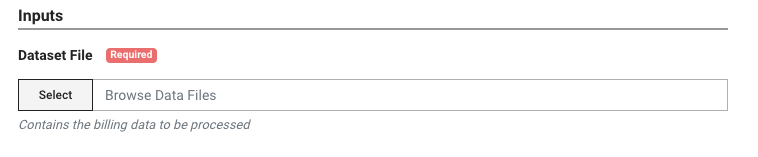
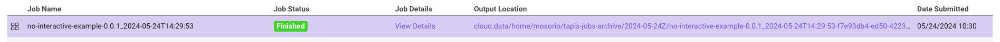

This template is the first in a [series of templates](#next-templates) that will guide you through the process of creating a cookbook and running it on TACC systems. From simple ones that run a command to more complex ones that run a Python script using conda or a Jupyter Notebook.

## Requirements

- A GitHub account
- TACC account. If you don't have one, you can request one [here](https://accounts.tacc.utexas.edu/register).
- To access TACC systems, you should have an [allocation](https://tacc.utexas.edu/use-tacc/allocations/).
  - You can see your allocations [here](https://ptdatax.tacc.utexas.edu/workbench/allocations/approved).
  - If you don't have an allocation, you can request one [here](https://portal.tacc.utexas.edu/allocation-request).

## Template Overview

This template creates a simple Python script that will be used to demonstrate how to run a cookbook on a TACC cluster and obtain the output using a UI. The cookbook will use a CSV file stored on TACC storage and run a Python script that reads it, calculates the average of the values in the first column, and writes the result to a file.

In this case, the file is small for demonstration purposes. However, you can use the same process to analyze large files.

### How does it work?

1. [`app.json`](app.json) file: contains the definition of the Tapis application, including the application's name, description, Docker image, input files, and advanced options.
2. [`Dockerfile`](Dockerfile): a Docker image is built from the [`Dockerfile`](./Dockerfile). The Docker image defines the runtime environment for the application and the files that will be used by the application.
3. [`run.sh`](run.sh): contains all the commands that will be executed on the TACC cluster.

### Upload files to TACC storage

One of the goals of the template is to demonstrate how to use the TACC storage system to store the input and output files. So, you should upload the CSV file to the TACC storage system.

1. Go to the [TACC Portal](https://portal.tacc.utexas.edu).
2. Click on the "Data Files" tab.
3. Click on the "Add +" button.
   
4. Click on the "Upload" button.
   
5. Select the file you want to upload and click `Upload Selected`.

### Modify the Dockerfile

The `Dockerfile` is used to create a Docker image that will be used to run the Python script. In this case, the Docker image is created using the `microconda` base image, which is a minimal image that contains conda.

For example, the Dockerfile below installs `curl` using `apt-get`. This is useful if you need to install packages that are not available in conda.

```Dockerfile
RUN apt-get update && apt-get install -y \
    curl \
    && rm -rf /var/lib/apt/lists/*
```

### Define conda dependencies using `environment.yaml`

The `environment.yaml` file is used to define the conda environment that will be used to run the Python script. In this case, the `environment.yaml` file contains the dependencies needed to run the Python script.

```yaml
name: base
channels:
  - conda-forge
dependencies:
  - python=3.9.1
  - pandas=1.2.1
```

### Job run script

The `run.sh` file is used to run the Python script. It activates the conda environment and runs the Python script.

```bash
#!/bin/bash
set -xe

cd ${_tapisExecSystemInputDir}
python /code/main.py billing.csv ${_tapisExecSystemOutputDir}/output.txt
```

The `run.sh` has two variables that are used to define the input and output directories. These variables are `_tapisExecSystemInputDir` and `_tapisExecSystemOutputDir` which are automatically set by the Tapis system.

- \_tapisExecSystemInputDir: The directory where the input files are staged
- \_tapisExecSystemOutputDir: The directory where the application writes the output files

## Create your cookbook

You can use this repository as a template to create your cookbook. Follow the steps below to create your cookbook.

### Create a new repository

1. Click on the "Use this template" button to create a new repository
2. Fill in the form with the information for your new repository

### Build the Docker image

1. Clone the repository
2. Build the Docker image using the command below

```bash
docker build -t cookbook-python .
```

3. Push the Docker image to a container registry

```bash
docker tag cookbook-python <your-registry>/cookbook-python
docker push <your-registry>/cookbook-python
```

### Modify the `app.json` file

Each app has a unique `id` and `description`. So, you should change these fields to match your app's name and description.

1. Download the `app.json` file
2. Change the values `id` and `description` fields with the name and description as you wish.

### Create a New Application on the Cookbook UI

1. Go to [Cookbook UI](https://in-for-disaster-analytics.github.io/cookbooks-ui/#/apps)
2. Click on the "Create Application" button
3. Fill in the form with the information from your `app.json` file
4. Click "Create Application"
5. A new application will be created, and you will be redirected to the application's page

### Run your Cookbook

1. Go to the application's page on the Cookbook UI, if you are not already there
2. Click on the "Run" button on the right side of the page. This will open the Portal UI
3. Click on the "Select" button to choose the input file
   
4. Click "Run"

### Check the output

1. After the job finishes, you can check the output by clicking on the "Output location" link on the job's page
   
2. You will be redirected to the output location, where you can see the output files generated by the job
   
3. Click on a file to see its content. In this case, the file is named `output.txt`
   

## Next templates

- [Running a command](https://github.com/In-For-Disaster-Analytics/Cookbook-Docker-Template)
- [Running a Python script using conda](https://github.com/In-For-Disaster-Analytics/Cookbook-Conda-Template)
- [Running a Jupyter Notebook](https://github.com/In-For-Disaster-Analytics/Cookbook-Jupyter-Template)

## Authors

- William Mobley - wmobley@tacc.utexas.edu
- Maximiliano Osorio - maxiosorio@gmail.com
